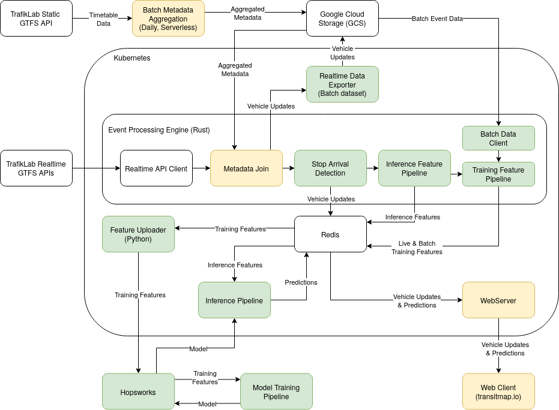

# Transitmap

[transitmap.io](https://transitmap.io) is an interactive realtime visualisation of all public transport in Sweden (or those parts of it that have realtime geolocations, anyway).

In the scope of the final project for the scalable machine learning course at KTH, we added timetables for all vehicles to the map,
and implemented a realtime stop arrival detection and future delay prediction for all metro vehicles.

This work included collecting a large dataset from the continuous stream of position updates and metadata,
implementing a fully modular machine learning pipeline for the delay prediction, and integrating that with the existing architecture of transitmap.
In the following we will describe our data, each component of the machine learning pipeline, and how everything fits into the overall architecture.

## Prediction Problem
The specific prediction problem that we are solving in this course project is to predict the delta between the scheduled arrival time
and the real arrival time for all future stops for all running metros in Stockholm.
So we are predicting future delays (and early arrivals) for metros that are currently on their way at any given time.

## Data
We are working with the publically available public transport data available from Trafiklab for all of Sweden.
This includes timetable data including metadata for all of Sweden, as well as a stream of realtime vehicle position updates for many transport agencies.
The timetable is in the static GTFS data format and is updates once per day.
The realtime position updates are a data stream with new events every 3 seconds.
On average this stream delivers over 4000 events per second and over 100 Million events per day.

Our custom event processing engine combines information from these two datasources in realtime to get a continuous stream of position updates with metadata.
This combined stream serves as the basis for our problem. We collected the whole stream for 3 weeks, totalling over 2.5 Billion events in total.
This dataset was the input for our batch feature pipeline.
After that, our continuous feature pipeline is now continuously extracting new training samples from the data stream for future model iterations.

## Architecture
We built a completely modular machine learning architecture for transitmap, following the best practices we learned in the course.

The below diagram shows transitmap's architecture, including the dataflow through the system.
Components colored in green are completely new and were added as part of this course project.
Components colored in yellow existed previously, but were changed in a major way for this course project.



## How to run locally
Transitmap can run locally using docker-compose.
This requires a small amount of setup, as follows.

### TrafikLab API Keys
To run SparkLink yourself, you need to provide your own API keys from [TrafikLab](https://www.trafiklab.se/).
This is completely free of charge. Follow these steps to set it up:

1. Login or create an account on [TrafikLab](https://www.trafiklab.se/).
2. Create a new project in your TrafikLab account.
3. Add API keys for the `GTFS Sweden Realtime (beta)` and `GTFS Sweden Static data (beta)` APIs to your project.
4. Create a file named `.env` in the root directory of this project and add your API keys to it. It should look like the following.

```
TRAFIKLAB_GTFS_RT_KEY=<realtime-api-key>
TRAFIKLAB_GTFS_STATIC_KEY=<static-data-api-key>
```
Note that, while the API keys you have just set up are are perfectly fine for testing, they not enough to run SparkLing continuously.
For this, the `Guld` API tier is required on the realtime API. This can also be requested from TrafikLab free of charge, but processing
the request typically takes a couple days.

### Running
Once you have set up your API keys, you can simply run SparkLing with the following command.
```
docker-compose up --build
```
The cluster takes a couple minutes to start fully.
Once everything is running, you can connect to the application in your browser on [localhost](http://localhost:80).

We recommend running without the feature uploader and the data exporter, since these require private credentials
for Google Cloud Storage access. They are not required for just running the application and are commented out in the compose file by default.
