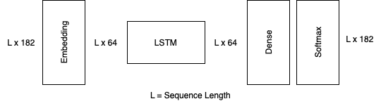

# Transitmap

[transitmap.io](https://transitmap.io) is an interactive realtime visualisation of all public transport in Sweden (or those parts of it that have realtime geolocations, anyway).

In the scope of the final project for the scalable machine learning course at KTH, we added timetables for all vehicles to the map,
and implemented a realtime stop arrival detection and future delay prediction for all metro vehicles.

This work included collecting a large dataset from the continuous stream of position updates and metadata,
implementing a fully modular machine learning pipeline for the delay prediction, and integrating that with the existing architecture of transitmap.
In the following we will describe our data, each component of the machine learning pipeline, and how everything fits into the overall architecture.

## Prediction Problem
The specific prediction problem that we are solving in this course project is to predict the delta between the scheduled arrival time
and the real arrival time for all future stops for all running metros in Stockholm.
So we are predicting future delays (and early arrivals) for metros that are currently on their way at any given time.

## Data
We are working with the public transport data available from Trafiklab for all of Sweden.
This includes timetable data including metadata for all of Sweden, as well as a stream of realtime vehicle position updates for many transport agencies.
The timetable is in the static GTFS data format and is updates once per day.
The realtime position updates are a data stream with new events every 3 seconds.
On average this stream delivers over 4000 events per second and over 100 Million events per day.

Our custom event processing engine combines information from these two datasources in realtime to get a continuous stream of position updates joined with all relevant metadata.
This combined stream serves as the basis for our problem. We collected the whole stream for 3 weeks, totalling over 2.5 Billion events (~1TB uncompressed json).
This dataset was the input for our batch feature pipeline.
After that, our continuous feature pipeline is now continuously extracting new training samples from the data stream for future model iterations.

## Architecture
We built a completely modular machine learning architecture for transitmap, following the best practices we learned in the course.

The below diagram shows transitmap's architecture, including the dataflow through the system.
Components colored in green are completely new and were added as part of this course project.
Components colored in yellow existed previously, but were changed in a major way for this course project.


## Feature Engineering

In order to be able to train a deel learning model on our notebooks, we decided to scale down the prediction problem.
For this iteration the predictions are limited to metros only.
From our data we extracted 3561 data samples.
Essentially, all public transport traffic from the 04.12.2023 to the 25.12.23 was simulated by pushing the collected events through the whole system in accelerated time, to generate training features from the previously collected data.

The entire feature pipeline is implemented in Rust, within Transitmap's larger event processing pipeline.
Previously this pipeline only attached the pre-aggregated metadata like the route name and trip headsign to each event.
Now, the pipeline uses the raw vehicle coordinates, as well as the trip's timetable, to detect when a stop is reached.
The feature pipeline collects this information each trip in memory and transforms it into a sequence of tokens for training or inference.

| #Samples  | #Val  | #Test  | #Tokens |
| --------- | ----- | ------ | ------- |
| 2507      | 537   | 537    | 125k    |

## LSTM Model

Because we are working with sequence data one of our models was a Recurrent Neural Network for a Sequence to Vector prediction.
We model our prediction problem similar to a language model, where the prediction task is to predict the next word.
In our vocabulary we encode relevant metadata like route, direction, day-of-the-week, time-of-day as well as stops and stop to stop delay deltas in 1 minute intervals between -15 and 15.
The sequences start with the metadata for the specific trip and continoue with each stop and delay interleaved.
During inference we provide all the realtime information up to the current stop in the trip and let the model predict the delay for the rest of the sequence.

We trained a number of models with different dimensions, the below table shows the notable examples that performed best at each model size.

| Parameters  | Tokens / Param  | #Layers | Hidden Size | Embedding Size | Test loss | 
| ----------- | --------------- | ------- | ----------- | -------------- | --------- | 
| 134k        | 0.93            | 1       | 128         | 64             | 0.251     | 
| 90k         | 1.39            | 2       | 64          | 64             | 0.246     | 
| 56k         | 2.23            | 1       | 64          | 64             | 0.241     | 
| 30k         | 4.17            | 1       | 32          | 64             | 0.246     | 
| 20k         | 6.25            | 1       | 32          | 32             | 0.263     | 

We can see in the above table that the model size plays a central role in model performance.
We find the `tokens / parameter` metric especially interesting to gather an intuition on how much training data is required for this specific model and prediction problem.
We found the best model performance at ~2.2 tokens per parameter, which is interesting for two reasons:
- It is much lower than the roughly 10 tokens / parameter that is typical in LLMs. We think this is because our sequences are much more consistently structured than natural language.
- Because of the structure of our sequences, we end up with roughly 1 delay token / parameter, which seems to make intuitive sense to us in this delay prediction problem.

The following diagram shows the layers and dimensions of our best model.



## How to run locally
Transitmap can run locally using docker-compose.
This requires a small amount of setup, as follows.

### TrafikLab API Keys
To run SparkLink yourself, you need to provide your own API keys from [TrafikLab](https://www.trafiklab.se/).
This is completely free of charge. Follow these steps to set it up:

1. Login or create an account on [TrafikLab](https://www.trafiklab.se/).
2. Create a new project in your TrafikLab account.
3. Add API keys for the `GTFS Sweden Realtime (beta)` and `GTFS Sweden Static data (beta)` APIs to your project.
4. Create a file named `.env` in the root directory of this project and add your API keys to it. It should look like the following.

```
TRAFIKLAB_GTFS_RT_KEY=<realtime-api-key>
TRAFIKLAB_GTFS_STATIC_KEY=<static-data-api-key>
```
Note that, while the API keys you have just set up are are perfectly fine for testing, they not enough to run SparkLing continuously.
For this, the `Guld` API tier is required on the realtime API. This can also be requested from TrafikLab free of charge, but processing
the request typically takes a couple days.

### Hopsworks API Keys

1. Login or create an account on [Hopsworks](https://www.hopsworks.ai)
2. Follow the instructions to finish account creation
3. Find your API key in the profile menu

```
HOPSWORKS_API_KEY=<hopsworks-api-key>
```
Note that the free tier should be enouph to support the feature pipeline for quite a long time.

### Running
Once you have set up your API keys, you can simply run SparkLing with the following command.
```
docker-compose up --build
```
The cluster takes a couple minutes to start fully.
Once everything is running, you can connect to the application in your browser on [localhost](http://localhost:80).

We recommend running without the feature uploader and the data exporter, since these require private credentials
for Google Cloud Storage access. They are not required for just running the application and are commented out in the compose file by default.
